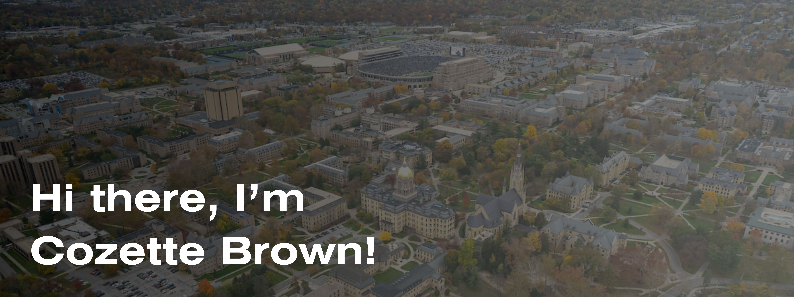
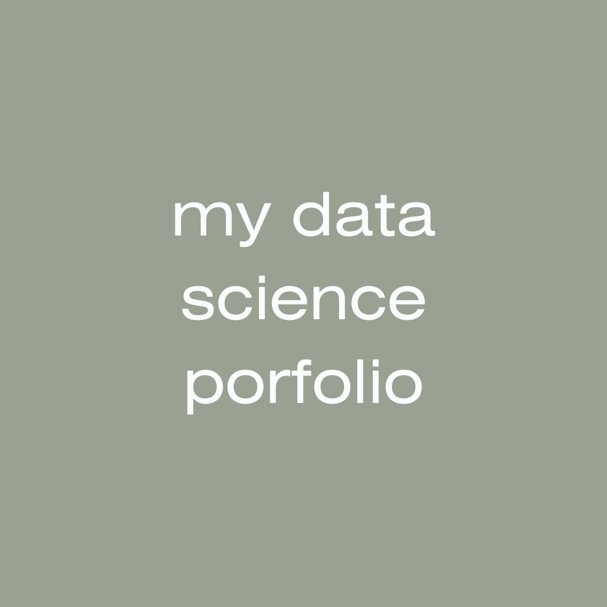

## 👋🏻 I'm Cozette Brown, a student learning data science at the University of Notre Dame.

**Major:** Program of Liberal Studies\
**Minors:** Data Science / Education, Schooling, and Society

- ⌨️ I recently completed my first course in computing. My proudest accomplishment from class is making a trackpad-friendly version of Minesweeper! 
- 🌱  I am currently learning the basics of data science in MDSC 20009: Introduction to Data Science. Check out my first Streamlit app via my data science portfolio below!
- 🥅  Goals for 2025: Improve my coding skills, try new data science tools, and work on more beginner projects!

**Professional Interests:** Justice Education, Anti-Poverty Initiatives, Non-profit Work, Education\
**Personal Interests/Hobbies:** Reading, Film, Knitting, Other Arts & Crafts

## 👩🏼‍💻 My Languages and Tools

* HTML/CSS
* Python
* Pandas
* Matplotlib
* Seaborn
* Streamlit

## 💬 Connect With Me!

- [LinkedIn](https://www.linkedin.com/in/cozette-brown)
- [Email](mailto:cbrown64@nd.edu)

## ⌨️ My Projects

### My First Streamlit App: *James Bond* Franchise
This Streamlit app provides a way to explore similarities and differences between films in the *James Bond* franchise. It incorporates basic elements of Streamlit app development, with room for further improvement as I learn additional capabilities using Streamlit and other packages.  
**Tools & Skills Showcased:**
* Python
* Pandas
* Streamlit

### Tidy Data Project: Federal R&D Budget
This project in Jupyter Notebooks applies the principles of tidy data in order to prepare a provided dataset for analysis and create meaningful data visualizations from it. 
**Tools & Skills Showcased:**
* Python
* Pandas
* Matplotlib
* Seaborn

## ➡️ Quick Links

