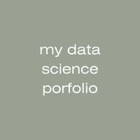

## 👋🏻 I'm Cozette Brown, a student learning data science at the University of Notre Dame.

**Major:** Program of Liberal Studies\
**Minors:** Data Science / Education, Schooling, and Society

- ⌨️ I recently released an unsupervised machine learning application in Streamlit, called Unsupervised!
- 🌱  I am currently learning the basics of data science in MDSC 20009: Introduction to Data Science. 
- 🥅  Goals for 2025: Improve my coding skills, try new data science tools, and work on more beginner projects!

**Interests:** Data Science, Humanities, Comparative Literature, Justice Education, Anti-Poverty Initiatives, Non-profit Work, Education

## 👩🏼‍💻 My Languages and Tools

* HTML/CSS
* Python
* Pandas
* Matplotlib
* Seaborn
* Streamlit

## 💬 Connect With Me!

- [LinkedIn](https://www.linkedin.com/in/cozette-brown)
- [Email](mailto:cbrown64@nd.edu)

## ⌨️ My Projects

### 1. My First Streamlit App: *James Bond* Franchise ([View in Portfolio](https://github.com/cozette-brown/BROWN-Data-Science-Portfolio/tree/45df5288c5c65b926761bc3010556b5a969bd744/basic_streamlit_app))
This Streamlit app provides a way to explore similarities and differences between films in the *James Bond* franchise. It incorporates basic elements of Streamlit app development, with room for further improvement as I learn additional capabilities using Streamlit and other packages.   
**Tools & Skills Showcased:**
* Python
* Pandas
* Streamlit

### 2. Tidy Data Project: Federal R&D Budget ([View in Portfolio](https://github.com/cozette-brown/BROWN-Data-Science-Portfolio/tree/45df5288c5c65b926761bc3010556b5a969bd744/TidyData-Project))
This project in Jupyter Notebooks applies the principles of tidy data in order to prepare a provided dataset for analysis and create meaningful data visualizations from it.  
**Tools & Skills Showcased:**
* Python
* Pandas
* Matplotlib
* Seaborn

### 3. Machine Learning App ([View in Portfolio](https://github.com/cozette-brown/BROWN-Data-Science-Portfolio/tree/main/MLStreamlitApp))
This Streamlit app allows users to use various machine learning models, experiment with hyperparameters, and evaluate models using either sample datasets or their own uploaded file. It integrates what I've learned so far about machine learning and creating meaningful visualizations, such as confusion matrices, to understand and convey important information about data.  
**Tools & Skills Showcased:**
* Python
* Streamlit
* Machine Learning w/ Sklearn
* Matplotlib
* Seaborn

### 4. Unsupervised Machine Learning App ([View in Portfolio](https://github.com/cozette-brown/BROWN-Data-Science-Portfolio/tree/main/MLUnsupervisedApp))
This Streamlit app allows users to use unsupervised learning models, experiment with hyperparaments, and evaluate models with resulting metrics and visualizions—all using an uploaded dataset or one of the available demos. It greatly improves upon my previous Streamlit app, showcasing not only my new understanding of unsupervised models but also my improvement in Streamlit design.
 
**Tools & Skills Showcased:**
* Python
* Streamlit
* Unsupervised Machine Learning w/ Sklearn
* Matplotlib

## ➡️ Quick Links

